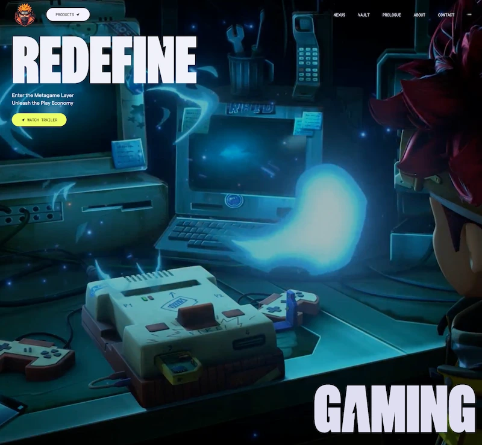

<div align="center">

# 🌟 Awwwards Web Style

Este proyecto es una aplicación web construida con **React** y **GSAP**. Esta hecho para aprender las nociones basicas y el uso de GSAP con React en una web.

 <p>Creado siguiendo el curso de <a href='https://www.jsmastery.pro/'>JS Mastery</a></p>

<strong><a href="https://awwwards-web.onrender.com">LINK</a></strong>




</div>

## 🛠️ Tecnologías Utilizadas

- **React**: Biblioteca de JavaScript para construir interfaces de usuario.
- **Vite**: Herramienta de construcción rápida para proyectos web modernos.
- **Tailwind CSS**: Framework de CSS para un diseño rápido y eficiente.
- **GSAP**: Biblioteca de JavaScript que permite a los diseñadores y desarrolladores crear animaciones de alto rendimiento

## 📦 Instalación

1. Clona el repositorio:
   ```sh
   git clone https://github.com/samuhlo-training/awwwards-web.git
   ```
2. Navega al directorio del proyecto:

   ```sh
   cd awwwards-web
   ```

3. Instala las dependencias
   ```sh
   npm install
   ```

## 📜 Scripts Disponibles

- **`pnpm dev`**: Inicia el servidor de desarrollo.
- **`pnpm build`**: Construye la aplicación para producción.
- **`pnpm lint`**: Ejecuta ESLint para encontrar y arreglar problemas en el código.
- **`pnpm preview`**: Previsualiza la aplicación construida.
